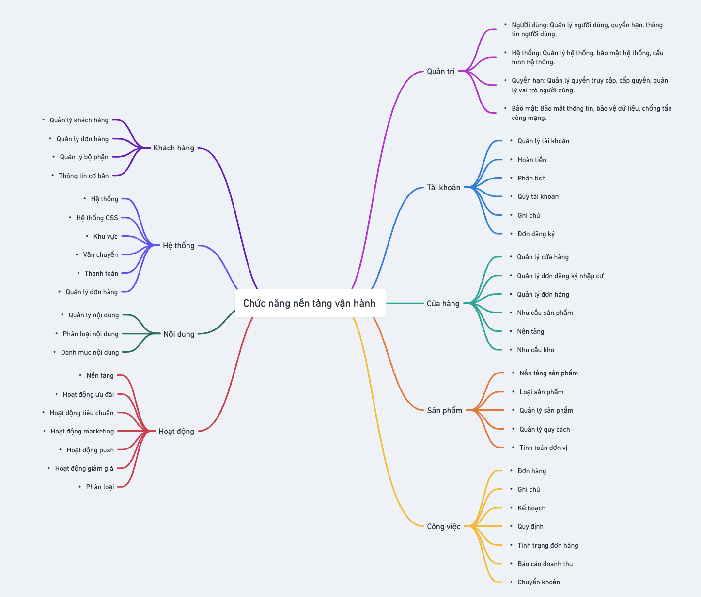
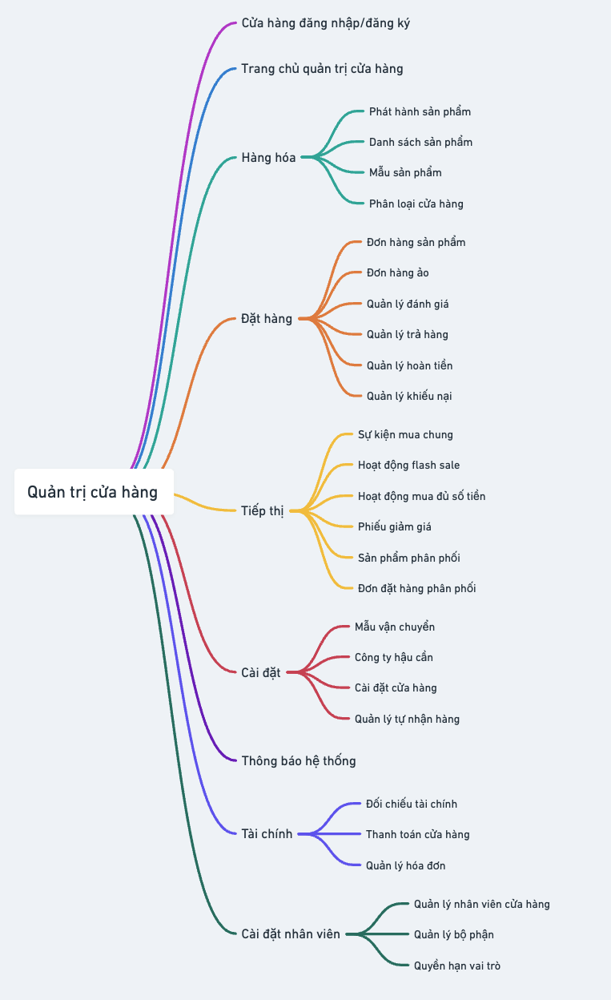

# Java E-commerce Backend - Open Source Project

## Overview

Welcome to the [Java E-commerce Backend open-source - shopdevjava.com](https://www.youtube.com/channel/UCky92hx0lZxVBi2BJ6Zm2Hg/join) project! This project aims to build a backend system for an e-commerce platform similar to Shopee (Version LITE). Our goal is to provide a robust, scalable, and flexible system to handle core e-commerce functionalities such as product management, orders, payments, inventory, etc.

This backend is developed in Java, utilizing modern frameworks and libraries, and follows best practices in software engineering. We encourage contributions and participation from the open-source community.

## How to Become a Contributor
If you are interested in contributing to this project, please follow the steps outlined in our contribution guidelines. We encourage all contributors to:
- Fork the repository. `https://github.com/anonystick/JAVA-ecommerce-backend-api-MEMBER.git`
- Create a feature branch.
- Commit your changes.
- Open a pull request for review.

The best approach is to follow this guide if you are new: [Hướng dẫn Lập Trình Viên tham gia PR vào cộng đồng OpenSource](https://www.youtube.com/watch?v=82oFC6cO5lg)

## Mind maps

### Project Architecture

1. Operating platform



2. Shop Management


3. User Management


4. Product Management

Updating...

## Features

FULL PLAYLIST: [PLAYLIST - Con đường trở thành LẬP TRÌNH VIÊN BACKEND JAVA](https://www.youtube.com/playlist?list=PLw0w5s5b9NK5Trt3AIxCtpRHWR7nI0RyX)

- **User Management**
  - User Registration and Authentication
  - Password Management
  - Profile Management
  - Two-factor authentication (2FA)
  
- **Product Management**
  - Add, Update, Delete Products
  - Categories and Tags
  - Search and Filter Products
  - Reviews and Ratings

- **Order Management**
  - Create, Update, Cancel Orders
  - Order Tracking
  - Payment Integration (Stripe, PayPal, etc.)
  - Order Status Notifications

- **Cart and Wishlist**
  - Add to Cart
  - Manage Wishlist

- **Inventory Management**
  - Stock Levels per Product
  - Backorders and Inventory Tracking

- **Shipping and Delivery**
  - Integration with shipping services (FedEx, DHL, etc.)
  - Real-time Shipping Rates and Estimated Delivery Time
  - Order Dispatch and Delivery Tracking

- **Payments**
  - Support Multiple Payment Methods
  - Payment Gateway Integration (Stripe, PayPal, etc.)
  - Refunds and Returns
  
- **Admin Dashboard**
  - Manage Users, Products, Orders, and Reviews
  - Analytics for Sales, Revenue, and User Behavior
  
- **Notifications**
  - Email and SMS Notifications for Orders and Shipping
  - Push Notifications

## Technologies

- **Java 17**
- **Spring Boot** (for RESTful APIs)
- **Hibernate / JPA** (for ORM and database interaction)
- **MySQL / PostgreSQL** (for data storage)
- **Redis** (for caching and session management)
- **Kafka / RabbitMQ** (for messaging and event-driven architecture)
- **ElasticSearch** (for search and filtering products)
- **Swagger** (for API documentation)
- **Docker** (for containerization)
- **Junit** and **Mockito** (for testing)
- **OAuth 2.0** and **JWT** (for authentication and security)

## Project Structure MVC 

```bash
ecommerce-backend
├── src/main/java/com/anonystick/ecommerce
│   ├── controller/            # REST API Controllers
│   ├── service/               # Business Logic
│   ├── model/                 # Data Models (Entities)
│   ├── repository/            # Data Access Layer
│   ├── config/                # Configuration files
│   ├── exception/             # Custom Exceptions
│   └── dto/                   # Data Transfer Objects (DTO)
├── src/main/resources
│   ├── application.yml        # Spring Boot Configuration
├── Dockerfile
├── docker-compose.yml
├── pom.xml                    # Maven Dependencies
└── README.md
```

## Project Structure DDD


```
.
├── MEMBER.md
├── README.md
├── mvnw
├── mvnw.cmd
├── myshop-framework
│   └── pom.xml
├── myshop-module-buyer
│   ├── pom.xml
│   └── src
│       └── main
│           └── java
│               └── com
│                   └── myshop
│                       └── BuyerApplicationApi.java
├── myshop-module-manager
│   ├── pom.xml
│   └── src
│       └── main
│           └── java
│               └── com
│                   └── myshop
│                       └── ManagerApplicationApi.java
├── myshop-module-store
│   ├── pom.xml
│   └── src
│       └── main
│           └── java
│               └── com
│                   └── myshop
│                       └── StoreApplicationApi.java
└── pom.xml
```

## Task Checklist

### User Management
- [ ] User Registration (Sign-up)
- [ ] User Authentication (Login/Logout)
- [ ] Implement JWT Token for Authentication
- [ ] Password Reset and Update
- [ ] Two-factor Authentication (2FA)
- [ ] Profile Management (Edit Profile, Upload Avatar)

### Product Management
- [ ] Create Product
- [ ] Update Product Details
- [ ] Delete Product
- [ ] Implement Search and Filter by Category
- [ ] Add Product Reviews and Ratings

### Order Management
- [ ] Create New Order
- [ ] Update Order Status (Processing, Shipped, Delivered, etc.)
- [ ] Cancel Order
- [ ] Integrate with Payment Gateway (Stripe/PayPal)
- [ ] Track Order Status and Delivery

### Cart and Wishlist
- [ ] Add to Cart
- [ ] View Cart and Checkout
- [ ] Add to Wishlist
- [ ] Remove from Cart/Wishlist

### Inventory Management
- [ ] Track Stock Levels for Products
- [ ] Handle Out-of-Stock Situations
- [ ] Implement Inventory Notification (Low Stock)

### Shipping and Delivery
- [ ] Integrate with Shipping APIs (FedEx/DHL)
- [ ] Provide Real-time Shipping Rates
- [ ] Implement Order Dispatch and Delivery Tracking

### Payments
- [ ] Integrate Stripe Payment
- [ ] Integrate PayPal Payment
- [ ] Handle Refunds and Returns
- [ ] Support Multiple Payment Methods

### Notifications
- [ ] Email Notifications for Order Confirmation
- [ ] SMS Notifications for Shipping Updates
- [ ] Push Notifications

### Admin Dashboard
- [ ] Manage Users
- [ ] Manage Products
- [ ] Manage Orders
- [ ] View Analytics (Sales, Revenue)

### Testing
- [ ] Write Unit Tests (Junit, Mockito)
- [ ] Write Integration Tests

## Contribution Guidelines

We welcome contributions! Please see our [CONTRIBUTING.md](./MEMBER.md) for details on the process for submitting pull requests.

### Getting Started

1. **Clone the Repository**: 
   ```bash
   git clone https://github.com/anonystick/JAVA-ecommerce-backend-api-MEMBER
   cd JAVA-ecommerce-backend-api-MEMBER
   ```

2. **Build the Project**:
   ```bash
   mvn clean install
   ```

3. **Run with Docker**:
   ```bash
   docker-compose up
   ```

4. **Access the API Documentation**:
   Once the server is running, go to: `http://localhost:9966/swagger-ui/`

## License

This project is licensed under the MIT License - see the [LICENSE](LICENSE) file for details.
